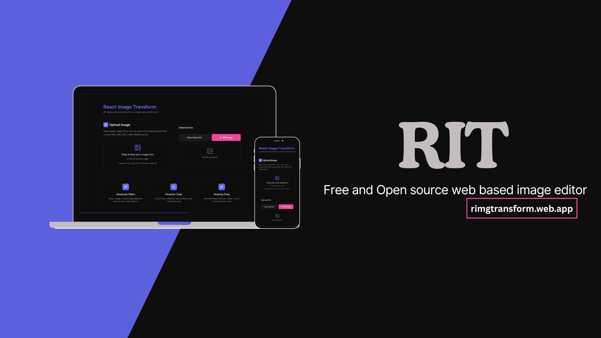

# RI-Transformer

Reactive Image Transformer: A modern, web-based image editor built with React and TypeScript.

Version 1.0.0

## About

A modern, web-based image editor built with React and TypeScript. Transform, edit, and export your images with an intuitive interface and powerful tools. RI-Transformer is designed to be fast, responsive, and easy to use, whether you are working on a desktop or mobile device.

## Features

- Real-time image transformations with instant preview
- Undo/Redo with configurable history management
- Crop, Resize, and Compress tools with interactive controls
- Multiple export formats (PNG, JPEG, WebP) with quality control
- Dark/Light theme support with persistent preferences
- Fully responsive design for desktop, tablet, and mobile

## Technologies

- React 19
- TypeScript
- Tailwind CSS
- Framer Motion
- Canvas API
- React Router

## Getting Started

1. Clone the repository
2. Install dependencies: `npm install`
3. Start the development server: `npm run dev`
4. Build for production: `npm run build`

## Links

- [GitHub Repository](https://github.com/tadstech/react-image-transformer)
- [Website](https://tadstech.web.app)

## License

Copyright 2025 Reactive Image Transformer. All rights reserved.

